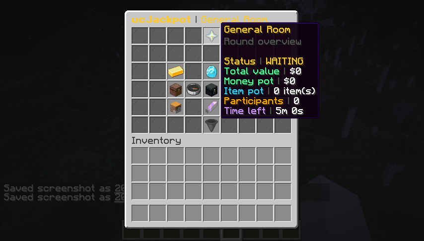
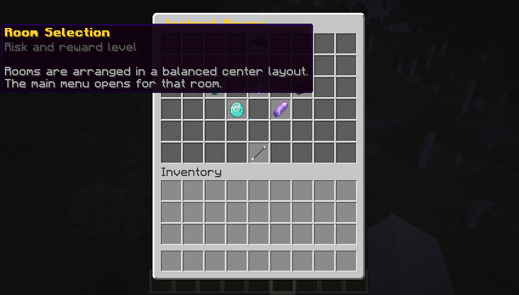
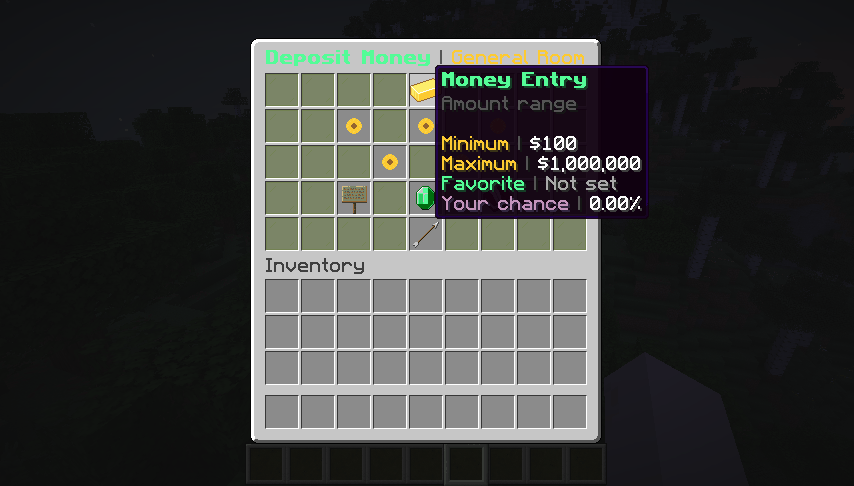
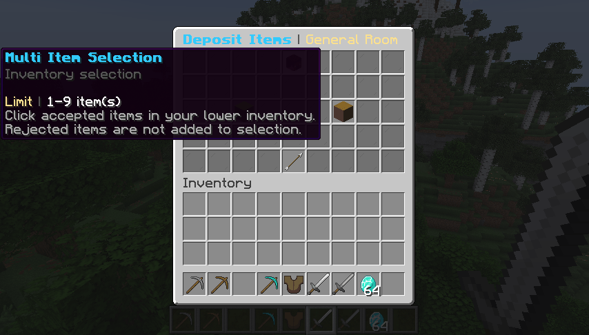
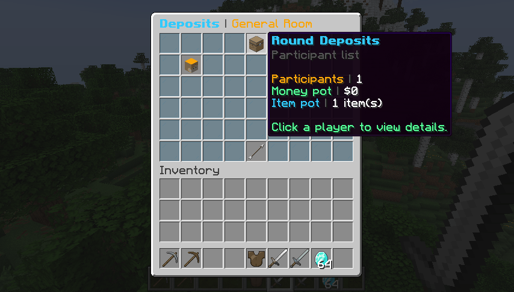
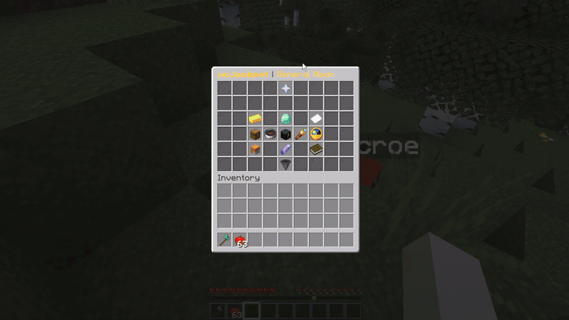
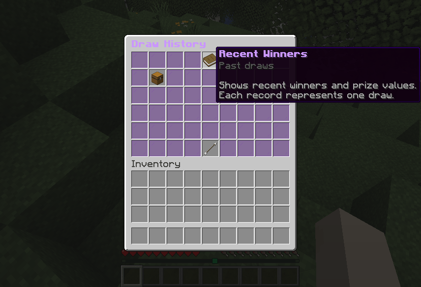

# ucJackpot

[](https://www.spigotmc.org/)
[](https://adoptium.net/)
[](LICENSE)

**ucJackpot** is a free, open-source jackpot plugin for Spigot, Paper, and Purpur servers. It supports money entries, real item entries, ticket entries, multiple jackpot rooms, GUI-driven player flows, mailbox overflow protection, audit logs, PlaceholderAPI, Vault economy support, and configurable localization.

Items deposited into a jackpot stay as real items. They are not converted into money. The winner receives the item pool directly, and overflow rewards are safely moved to the mailbox when the inventory is full.

---

## Highlights

- Money, item, hybrid, ticket, low-risk, high-risk, and event jackpot rooms
- Fully configurable room files under `jackpots/*.yml`
- GUI files separated from chat language files
- Only the selected locale and fallback locale are extracted on startup
- Clear console errors for broken language, GUI, and jackpot YAML files
- Dynamic command aliases from `config.yml`
- Help output adapts to the command the player used, such as `/jackpot rooms` or `/jp rooms`
- Persistent favorite money amount
- Participant-only 10-second draw title animation with per-player toggle
- Item entry limits count selected stacks, so a limit of 9 allows up to 9 full item stacks
- Reclaim GUI for deposits before the round countdown starts
- Mailbox system for full inventories and offline item delivery
- Draw history with draw id, seed, hash, entry id, and detailed audit data
- Java 21 build target, compatible with Java 21+ runtimes

---

## GIF Previews

### Main Menu



### Rooms Menu



### Money Deposit



### Item Selection



### Deposits Viewer



### Winner Watch Animation



### History and Fairness



---

## Requirements

| Requirement | Status |
| --- | --- |
| Java | Build target Java 21, runs on Java 21+ |
| Server | Spigot, Paper, or Purpur 1.21.x |
| Economy | Vault + economy plugin for money rooms |
| PlaceholderAPI | Optional |
| Database | SQLite by default, MySQL/MariaDB supported |

---

## Installation

1. Download `ucJackpot-1.0.0.jar`.
2. Put it into your server `plugins/` folder.
3. Start the server once.
4. Edit `plugins/ucJackpot/config.yml`.
5. Edit jackpot rooms under `plugins/ucJackpot/jackpots/`.
6. Run `/ucjackpot reload`.

Default player commands are available through:

- `/ucjackpot`
- `/jackpot`
- `/jp`
- `/ucj`

Aliases are configurable in `config.yml`.

---

## Configuration Layout

| File | Purpose |
| --- | --- |
| `config.yml` | Global settings, storage, economy, notifications, metrics, logging, command aliases, security |
| `jackpots/*.yml` | Jackpot room rules, limits, values, rewards, tickets, season id |
| `lang/<locale>.yml` | Chat feedback only |
| `gui/<locale>/<menu>.yml` | GUI titles, item names, lore, slots, materials, sounds |

Default language is English. Supported languages:

- English (English) - `en`
- Turkish (Türkçe) - `tr`
- German (Deutsch) - `de`
- French (Français) - `fr`
- Spanish (Español) - `es`
- Portuguese (Português) - `pt`
- Russian (Русский) - `ru`
- Arabic (العربية) - `ar`
- Chinese (中文) - `zh`
- Japanese (日本語) - `ja`
- Korean (한국어) - `ko`

The plugin extracts only the configured locale and fallback locale. Changing `settings.default-locale` and running `/ucjackpot reload` loads the new language files automatically.

---

## Draw Title Notifications

The draw process runs for 10 seconds by default. Draw titles are shown only to players who joined the jackpot room being drawn, and rewards are delivered when the draw process finishes.

Server owners can disable the title system or change the animation duration in `config.yml`:

```yaml
notifications:
  draw-titles:
    enabled: true
    player-toggle: true
    animation-seconds: 10
  chance-updates:
    mode: actionbar
    include-actor: false
```

Players can toggle their own draw title notifications with `/jackpot title` when `player-toggle` is enabled.
Chance updates can be sent through `actionbar`, `chat`, or disabled with `off`.

---

## Commands

See [docs/COMMANDS.md](docs/COMMANDS.md) for the complete command and permission list.

Common commands:

| Command | Description |
| --- | --- |
| `/jackpot rooms` | Open the room selector |
| `/jackpot open [room]` | Open a room's main GUI |
| `/jackpot join [room] [amount]` | Enter with money |
| `/jackpot item [room]` | Enter with the held item |
| `/jackpot ticket [room]` | Enter with a jackpot ticket |
| `/jackpot mailbox` | Claim mailbox rewards |
| `/jackpot title` | Toggle personal draw title notifications |
| `/jackpot history` | Open recent winners |
| `/jackpot reload` | Reload config, language, GUI, and rooms |

---

## Placeholders

PlaceholderAPI identifier: `ucjackpot`

See [docs/PLACEHOLDERS.md](docs/PLACEHOLDERS.md) for all available placeholders.

Example:

```text
%ucjackpot_pot%
%ucjackpot_players%
%ucjackpot_time_left%
%ucjackpot_player_chance%
```

## Building From Source

```bash
mvn clean package
```

The compiled jar is generated at:

```text
target/ucJackpot-1.0.0.jar
```

This project is built with Java 21 release bytecode. You can compile it with JDK 21 or newer.

## License

ucJackpot is released under the MIT License. See [LICENSE](LICENSE).
